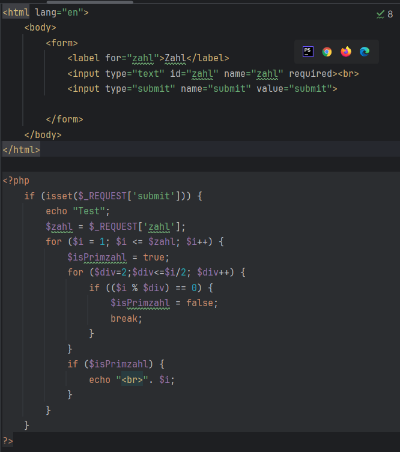
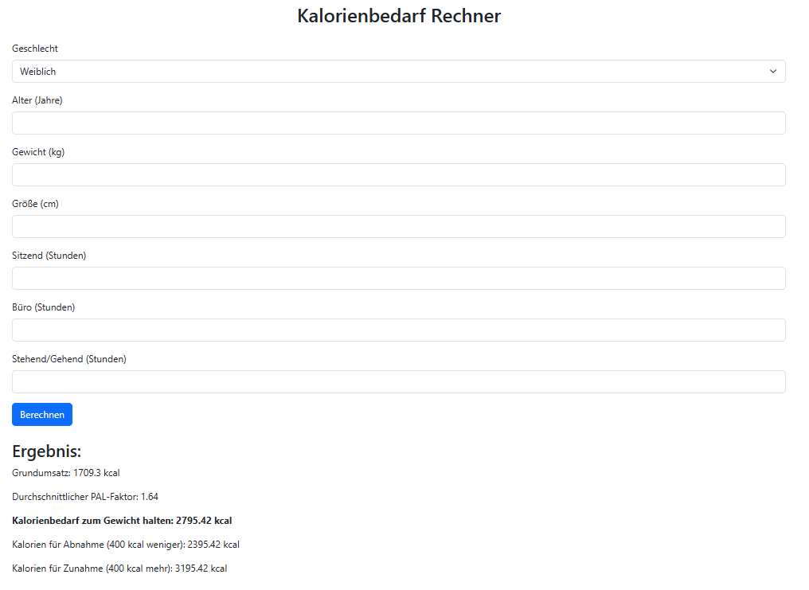
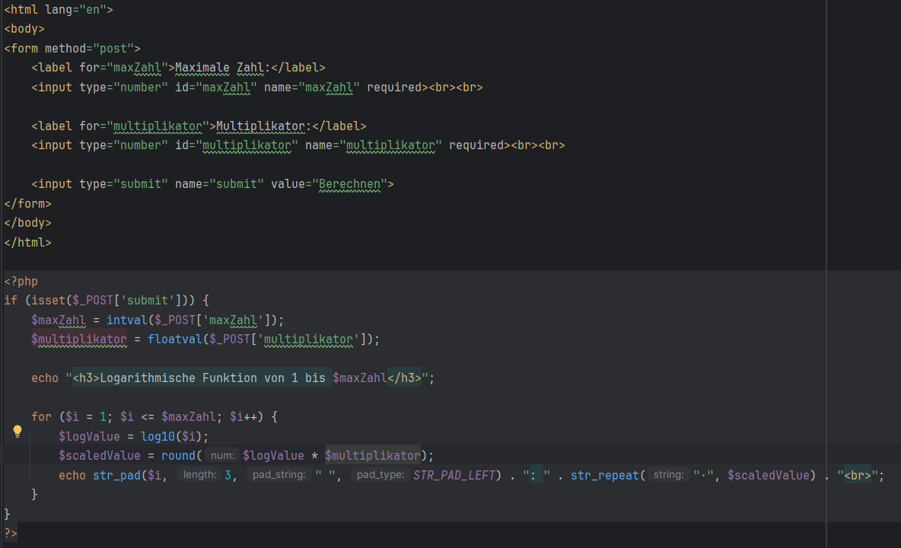
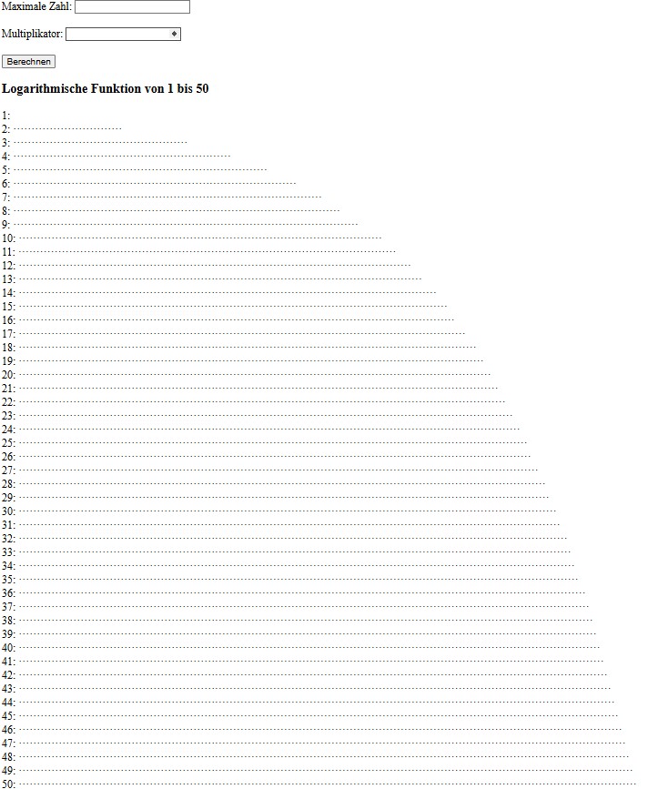

# 3. Übung - Kontrollstrukturen
### Schuljahr 24/25
### Lehrgang 2
### Übungstag 27.11.2024
### Tobias Kügerl
### Gruppe B

# Aufgabenstellung
Primzahlenberechnung:
-	Auf einer HTML Seite sind alle Primzahlen von 1 bis zur eingegeben Zahl auszugeben.
-	Tipp: Jede Zahl durch alle Zahlen von 2 bis n/2 dividieren

2. Übung:
-	Ausgabe der Logarithmischen Funktion:
-	Berechne den Log(n) für alle Zahlen von 1 bis 100
-	Gib jeweils Sterne in einer Zeile für jedes Ergebnis aus.

# Lösung
- Primzahlberechnung:  

- Ausgabe Logarithmischen Funktion: 

