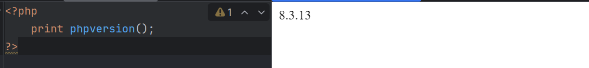

# 1. Übung - Einführung
### Schuljahr 24/25
### Lehrgang 2
### Übungstag 20.11.2024
### Tobias Kügerl
### Gruppe B

# Aufgabenstellung

- Kommunikationsablauf – Webserver und Client/Browser
- Installation Entwicklungsumgebung (Webserver+PHP+MySQL/MariaDB - oder Alternative und ein Editor mit PHP Support)
- Sicherheitsrisiken von Webanwendungen (Phishing, Datendiebstahl, SQL Injections, Cross-Site-Scripting, Session-Hijacking, DoS, ...)
- Maßnahmen zum Schutz von Webanwendungen (Verschlüsselung, Multifaktor Authentifizierung, Sanitizing/Prepared Statements,...)

# Lösung

## Fragen

### Kommunikationsablauf – Webserver und Client/Browser
- Anfrage: Der Browser sendet eine HTTP(S)-Anfrage an den Webserver.
- Verarbeitung: Der Webserver bearbeitet die Anfrage und leitet sie ggf. an PHP/Datenbank weiter.
- Antwort: Der Server liefert die generierte HTML-/JSON-Antwort zurück.
- Anzeige: Der Browser rendert die Inhalte für den Nutzer.
### Installation der Entwicklungsumgebung
- Webserver: Installiere Apache, Nginx oder XAMPP/WAMP/MAMP.
- PHP: Installiere PHP und teste mit phpinfo().
- Datenbank: Nutze MySQL/MariaDB (z. B. über phpMyAdmin).
- Editor: Verwende Visual Studio Code, PhpStorm oder Sublime Text.
### Sicherheitsrisiken von Webanwendungen
- Phishing: Falsche Webseiten täuschen Nutzer.
- SQL Injections: Manipulation der Datenbank durch unsichere Eingaben.
- XSS: Einfügen von schädlichem JavaScript.
- Session-Hijacking: Diebstahl von Sitzungsdaten.
- DoS: Überlastung des Servers.
### Maßnahmen zum Schutz
- Verschlüsselung: Einsatz von HTTPS (TLS/SSL) für sichere Datenübertragung.
- Authentifizierung: Nutzung von Multifaktor-Authentifizierung (MFA).
- Eingabesicherung: Input-Sanitizing und parametrisierte Queries gegen SQL-Injection.
- Zugriffsbeschränkung: Prinzip der minimalen Rechte und Rate Limiting.
- Updates: Regelmäßige Aktualisierung von Software und Bibliotheken.
