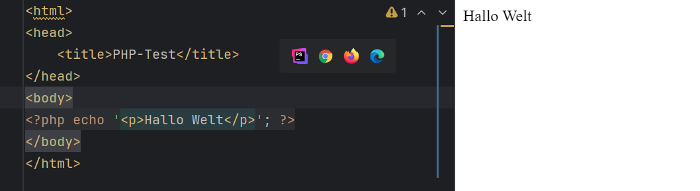
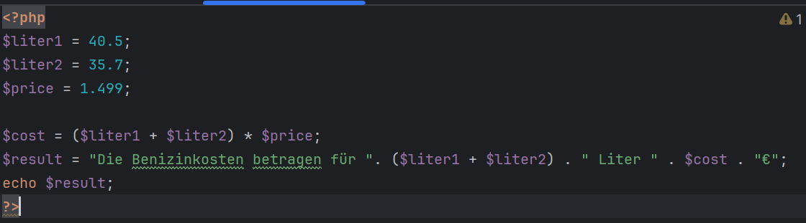

# 1. Übung - Einführung
### Schuljahr 24/25
### Lehrgang 2
### Übungstag 20.11.2024
### Tobias Kügerl
### Gruppe B

# Aufgabenstellung

- Zwei Tankfüllungen (liter1=40.5, liter2=35.7) mit dem gleichen Literpreis (preis=1.499) sind zu multiplizieren und als Kosten (kosten) in einem Aussagesatz anzuzeigen.
- Dafür wird im 1. Teil die Kostenermittlung durchgeführt.
- Im 2. Teil wird bei der Ergebnisanzeige eine Zeichenkette durch Verbindung aus: Der Zeichenkette "Die Benzinkosten betragen für ", der Addition der Variablen liter1 + liter2, der Zeichenkette "Liter ", der Variablen kosten und der Zeichenkette "€" gebildet.

- ERWEITERUNG: Dateneingabemöglichkeiten recherchieren (POST/GET Variablen mittels HTML Formularen)
# Lösung
- Eine Test PHP Datei, auf das htdocs Verzeichnis kopieren und tester.

- Die Tanfüllung Aufgabe.

## Fragen

### Welche Informationen liefert die Funktion phpinfo();
- PHP-Version: Aktuell installierte PHP-Version.
- Konfigurationsdetails: Informationen zu den in PHP aktiven Konfigurationsoptionen und Direktiven (php.ini).
- Installierte Module und Erweiterungen: Liste aller geladenen PHP-Erweiterungen (z. B. mysqli, gd, curl).
- Server-Details: Angaben zur Server-Software, Betriebssystem und Pfaden.
- Umgebungsvariablen: Informationen zu Umgebungsvariablen und Servervariablen.
- Kompilierungsoptionen: Angaben, mit welchen Optionen PHP kompiliert wurde.

### **PHP.ini Einstellungen und ihre Funktionen**

#### **PHP-Fehler ausgeben**
- **Direktive:** `display_errors`
- **Funktion:** Steuert, ob PHP-Fehler im Browser angezeigt werden.  
  - `On`: Fehler werden angezeigt (für Entwicklung).  
  - `Off`: Fehler werden unterdrückt (für Produktion empfohlen).

#### **Speichernutzung und Laufzeit limitieren**
- **Direktiven:**
  - `max_execution_time`: Begrenzt Skript-Laufzeit (z. B. `30` für 30 Sek.).  
  - `memory_limit`: Begrenzt den Speicherverbrauch (z. B. `128M` für 128 MB).  
- **Funktion:** Verhindert übermäßigen Ressourcenverbrauch.

#### **allow_url_fopen = off**
- **Funktion:** Verhindert, dass Funktionen wie `fopen()` oder `file_get_contents()` externe URLs laden können.  
- **Sicherheitsaspekt:** Schutz vor Remote File Inclusion (RFI).

#### **session.auto_start = off**
- **Funktion:** Deaktiviert das automatische Starten von Sessions.  
- **Empfehlung:** Sessions manuell mit `session_start()` starten für mehr Kontrolle.
